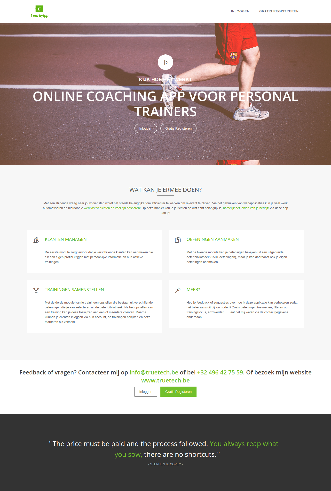
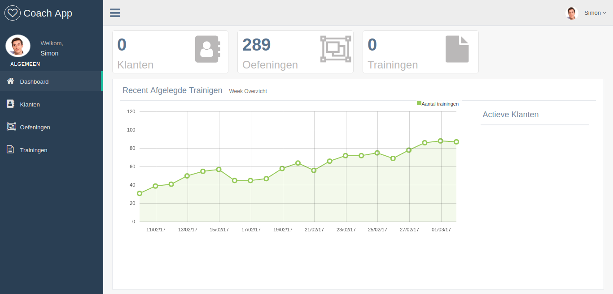
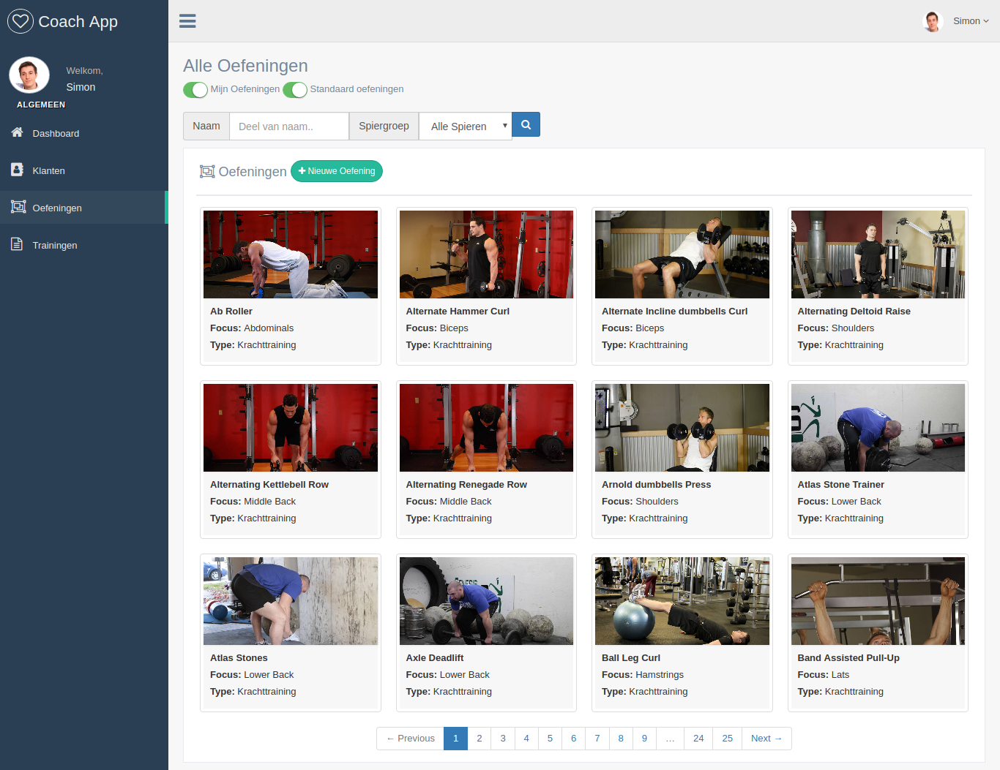
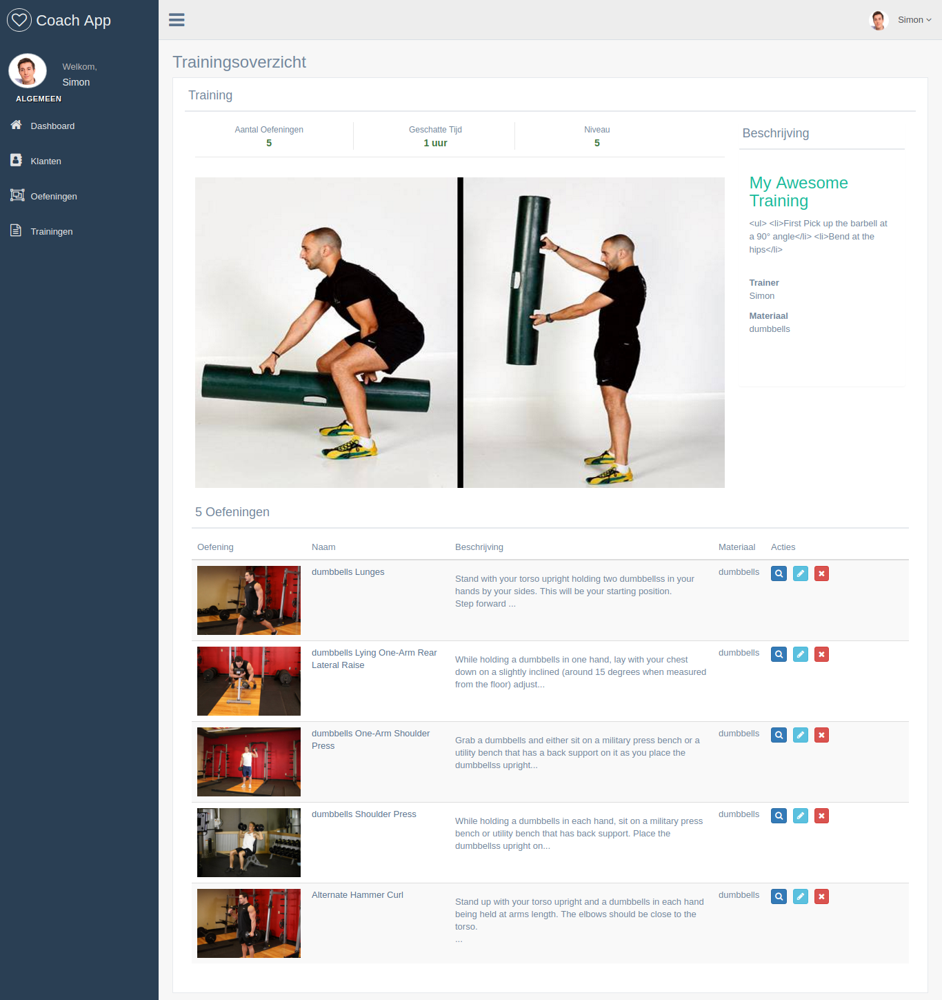
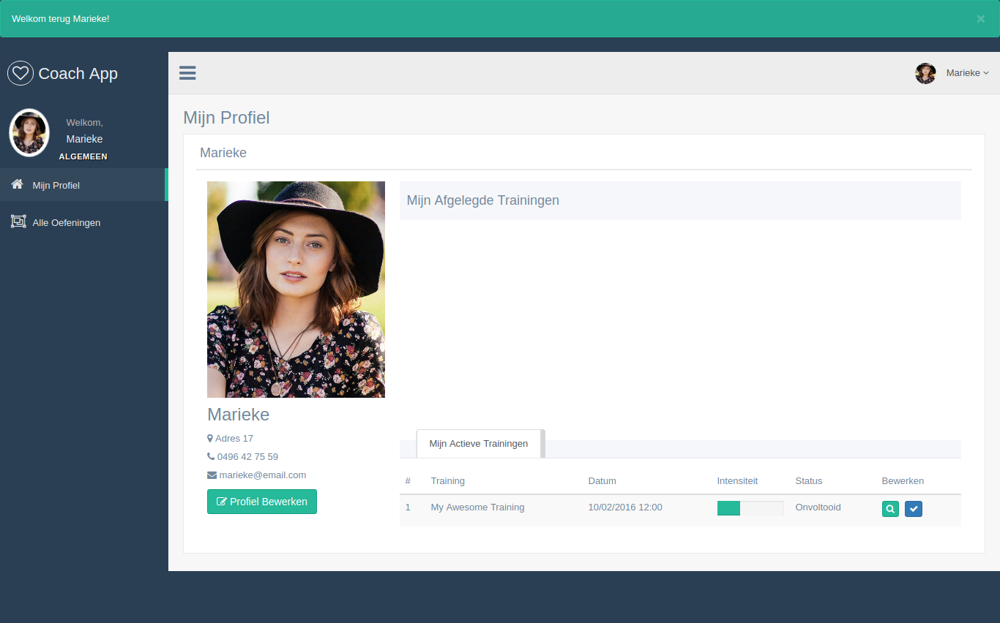

# Coach App

>Coach app is an application that allows personal trainers to manage their online cliënts by;
- Managing cliënt profiles
- Crudding custom exercises
- Selecting standard exercises from a library
- Crudding trainings based on the exercise library for specific cliënts (main feature)
- Allow cliënts to see the training, check its exercises and mark it as completed (and hopefully also do the workout lol)

<b>User demo login:</b> demo@email.com & password  
<b>Client demo login:</b> sara@email.com & password

# Tech Stack

- <b>Front:</b> HTML, CSS, JS, Ajax
- <b>Back:</b> Ruby & RoR
- <b>Db:</b> Postgresql
- <b>JS Libraries:</b> select2, starr, mask, flot, lightgallery & switchery
- <b>Other:</b> Bodybuilding.com scraping, custom login system, carrierwave file upload to aws, pagination, filter queries, 2 join tables & 1 self join table

# Pics Or It Didn't Happen

## Landing Page

## Dashboard

## Exercise Library

## Training Detail

## Cliënt View

# To Do

- Export trainings to PDF
- Expand database with different sport/training types
- Add messaging system
- Clean messy JS from views
- Test & Refactor
- Sell it for 1 million billion

Made with <3 by [TrueTech]("www.truetech.be/en")
